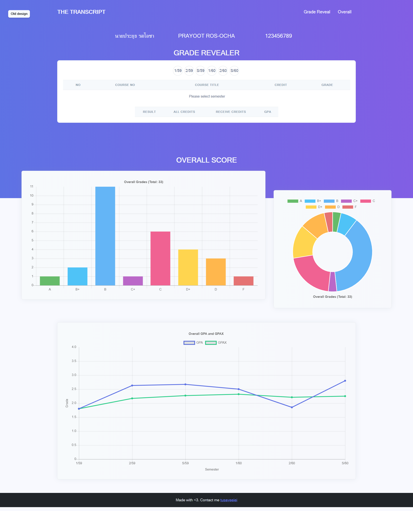
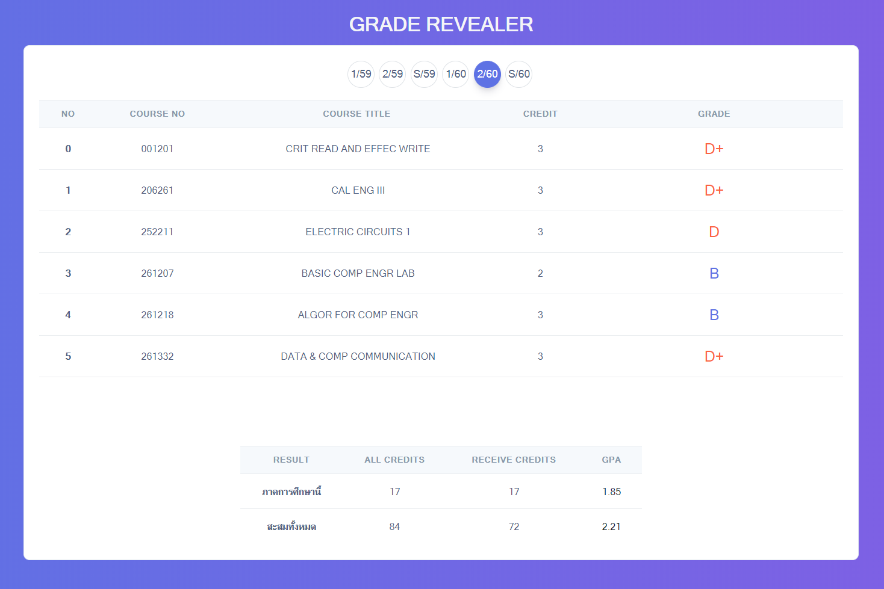
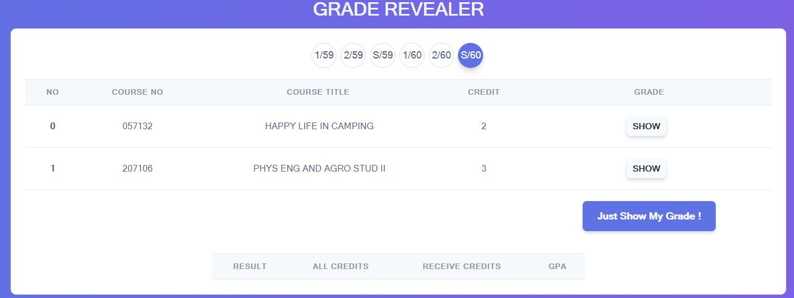
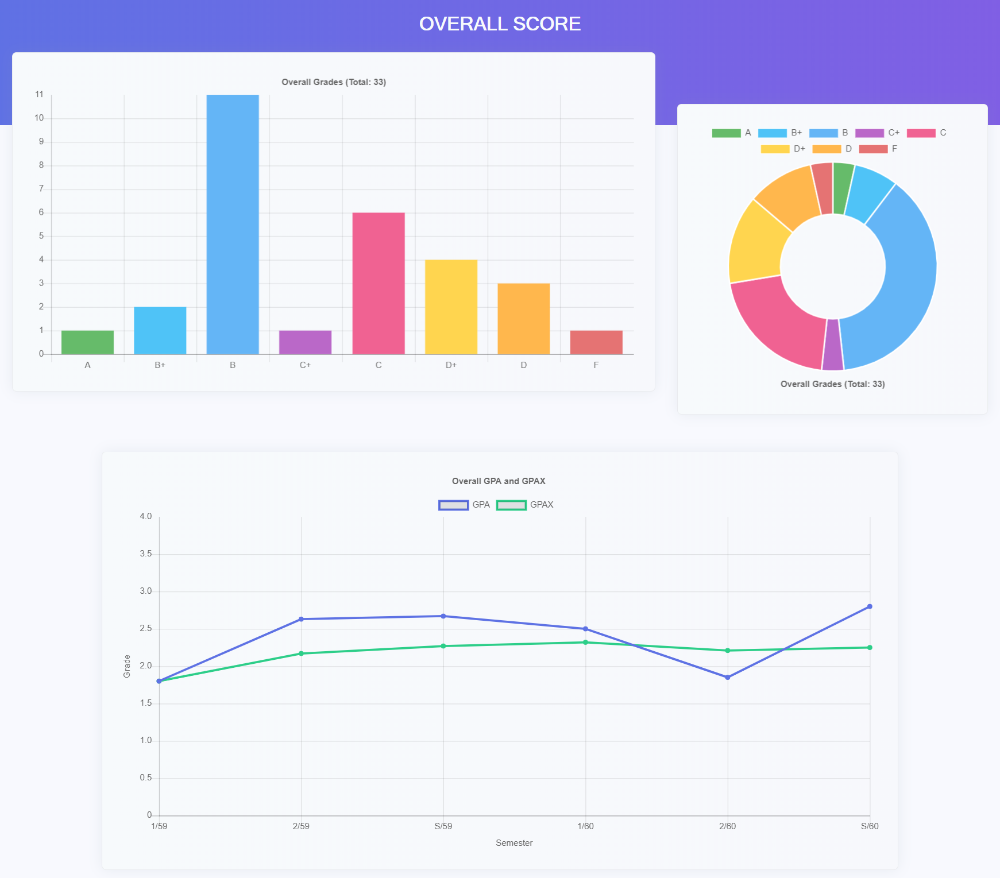

# The New CMU transcript

This is **the new transcript UI page** for [Chaing Mai University transcript page](https://www3.reg.cmu.ac.th/transcript)\_

### Screenshot

  

  

  

  

## TODO features

- [x] \*\*Show grade mode
- [x] Switch between modern and new
- [x] 1. Show all
- [x] 2. Show by each course
- [x] \*\*Show grade when clicked the grade card
- [x] Show student grade stats
- [ ] Input predicted GPA -> show it's actually greater than (>) / lower than(<) / equal(=) predicted one
- [ ] Select the predicted grade for each course -> show it's matched / not matched
- [ ] List total grade you've got (A: x, B+: y, B: z)
- [ ] GPA Calculator

### Author

Designed and Created by [Tusave](https://www.facebook.com/tusaveeiei)
